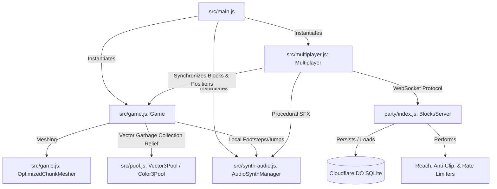
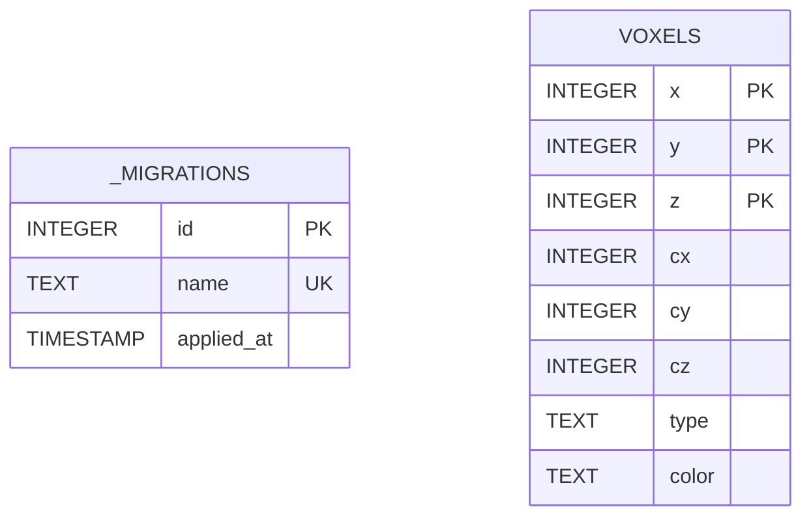
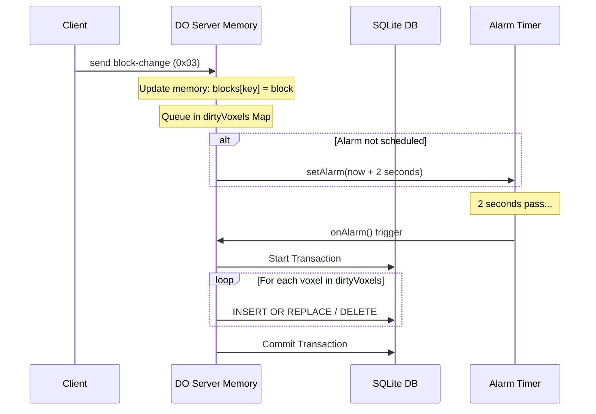

# Blocks Engine Architecture & Developer Guidelines

This document provides developer guidelines for the architecture, module boundaries, WebGL rendering, memory optimizations (GC avoidance), network protocols, and database persistence layers of the **Blocks** sandbox engine.

---

## 1. Directory Structure

The repository follows a clean separation between the frontend client, backend multiplayer server, configuration files, and testing framework:

```
Blocks/
├── dist/                   # Compiled production build output (HTML, JS, CSS)
├── downloads/              # Recorded gameplay webm files (testing/evaluation)
├── party/                  # Server-side module directory (PartyKit + Durable Objects)
│   └── index.js            # Server room entry point, SQLite storage, and validation
├── scratch/                # Developer helper scripts and temporary debug files
├── src/                    # Client-side source code
│   ├── game.js             # Babylon.js engine, Greedy Meshing, terrain, and physics
│   ├── main.js             # Client orchestrator, DOM bindings, and input router
│   ├── multiplayer.js      # Client-side PartySocket connection and message serialization
│   ├── pool.js             # Vector3 and Color3 object pools for GC relief
│   └── synth-audio.js      # Procedural Web Audio API synthesizer voice manager
├── tests/                  # End-to-End browser integration tests
│   ├── blocks.spec.js      # Scene verification, block placement, and jump physics tests
│   └── bot.spec.js         # Bot navigation inputs and progressive movement tests
├── index.html              # Main web entry page (HUD, lobby UI, and canvas container)
├── package.json            # Node project configuration and script definitions
├── partykit.json           # PartyKit hosting and server configuration
├── style.css               # HUD overlays, keyboard overlays, and global style rules
└── vite.config.js          # Vite compilation and HMR bundler configuration
```

---

## 2. Module Boundaries & Responsibilities

The system is split into distinct client-side and server-side components that communicate via WebSockets:

### Client-Side Modules

#### `src/main.js` (App Orchestrator)
*   **Role**: Main entry point for the browser application.
*   **Responsibilities**:
    *   Manages UI state transitions (Lobby screen to Game HUD) and player color swatch selections.
    *   Registers event listeners for HUD key trackers (`F3` debug console) and keypress indicators.
    *   Orchestrates screen recording using `HTMLCanvasElement.captureStream(30)` to encode and download gameplay as WebM/VP9 clips.
    *   Handles browser pointer-lock requests safely, implementing debouncers to avoid browser security rejections.
    *   Instantiates the global `Game`, `Multiplayer`, and `AudioSynthManager` instances.

#### `src/game.js` (3D Engine, Terrain & Physics)
*   **Role**: Handles all 3D scene rendering, local world generation, and client-side kinematics.
*   **Responsibilities**:
    *   Spawns the Babylon.js `Engine`, `Scene`, light arrays, shadows, and fog.
    *   Implements **Greedy Meshing** via the `OptimizedChunkMesher` class to combine adjacent coplanar voxel faces.
    *   Generates procedural voxel textures dynamically on HTML canvases during initialization.
    *   Generates local terrain height utilizing a deterministic 3-octave Fractional Brownian Motion (fBm) noise algorithm.
    *   Manages player camera inputs, checking grounded states, collision offsets, and kinematic jump curves.
    *   Exposes global hooks (`window.game`) for programmatic testing.

#### `src/multiplayer.js` (Network Sync Client)
*   **Role**: Manages socket connectivity and player synchronization.
*   **Responsibilities**:
    *   Maintains a `PartySocket` client connected to the PartyKit room.
    *   Serializes player coordinates and block changes into compact binary packets.
    *   Deserializes incoming binary state messages and JSON updates.
    *   Manages representations of remote player models (e.g., box heads, bodies, names) inside the local scene.
    *   Sends local player movement state ticks at a throttled rate (10Hz).
    *   Hooks network edits into `AudioSynthManager` to play location-aware placing or breaking sounds.

#### `src/pool.js` (Object Pool Optimization)
*   **Role**: Mitigates garbage collection pauses by reusing math objects.
*   **Responsibilities**:
    *   Offers pre-allocated `Vector3Pool` and `Color3Pool` instances.
    *   Provides `acquire()` and `release()` interfaces for vector and color operations.
    *   Includes `debugMode` checks to audit active allocations, prevent double-releases, and identify potential object leaks.

#### `src/synth-audio.js` (Procedural Synthesizer)
*   **Role**: Low-latency sound generator utilizing Web Audio API.
*   **Responsibilities**:
    *   Pre-allocates a voice pool (`SynthVoice` instances) with static node paths (`Oscillator/Buffer -> BiquadFilter -> Gain -> Destination`) to prevent runtime allocation overhead.
    *   Implements voice-stealing logic using age and priority heuristics (e.g., Footstep < Place/Break < Jump) with a rapid 10ms fade envelope to prevent clicks or pops.
    *   Generates material-specific footstep crunches, place pitch sweeps, break rumbles, and jump sweeps using raw oscillators and noise generators.

---

### Server-Side Modules

#### `party/index.js` (PartyKit & Durability Engine)
*   **Role**: Authoritative game room host and persistence coordinator.
*   **Responsibilities**:
    *   Maintains the master database of placed voxels using Cloudflare Durable Objects' SQLite backend (`this.room.storage.sql`).
    *   Performs database schema migrations (converting flat Key-Value records to organized SQLite rows).
    *   Implements authoritative movement safety checking, teleporting players back to the terrain surface if they attempt to clip inside solid blocks.
    *   Implements reach checking (bounding block manipulation to `dist <= 8.0` units) and anti-griefing/spawn protection rules.
    *   Applies token-based rate limits on block adjustments to throttle rapid automated updates.
    *   Saves modifications progressively to SQLite via a debounced DO Alarm (2000ms delay), ensuring a final flush happens immediately when the last player disconnects.

---

## 3. Class Relationships & Architecture

The following diagram illustrates how components interact during a standard session:



---

## 4. WebGL & Render Loop Optimizations

The rendering subsystem in `src/game.js` is designed to run at high frame rates (60–120+ FPS) on low-end devices by decoupling simulation logic, minimizing draw calls, and avoiding layout thrashing.

### 4.1 Babylon.js Frame Rate Decoupling

To ensure that physics simulation runs at a uniform speed regardless of the device's render frame rate, simulation steps scale dynamically using a normalized delta time (`dt`).

*   **Delta Calculation:** In the `onBeforeRenderObservable` loop (hot path), `dt` is computed by dividing the elapsed frame time in milliseconds by the baseline 60 FPS frame time (16.666 ms).
*   **Physics Capping:** To prevent simulation instability (e.g., clipping through blocks or falling out of the world) during heavy lag spikes or when the browser tab runs in the background, `dt` is capped at `4.0`.

```javascript
// From src/game.js (Custom gravity and physics solver)
const dt = Math.min(4.0, this.engine.getDeltaTime() / 16.666);

// Apply gravity scaled by delta time
this.verticalVelocity -= 0.012 * dt;
if (this.verticalVelocity < -0.3) {
  this.verticalVelocity = -0.3; // Terminal velocity
}
```

### 4.2 Camera Update Delta Scaling

The default Babylon.js camera update mechanism is overridden to utilize a custom axis-aligned bounding box (AABB) collision solver scaled by the same delta time.

*   **Zero-Allocation Movement Vector:** A pre-allocated scratch vector `_displacement` is used to prevent allocating a new `Vector3` object every frame.
*   **Delta Scaling:** The raw keyboard inputs are scaled by `dt` before executing collision checks.

```javascript
// From src/game.js (camera.update override)
const originalUpdate = this.camera.update;
this.camera.update = () => {
  this.camera._checkInputs(); // Process inputs into cameraDirection

  if (Math.abs(this.verticalVelocity) > 0.0001) {
    this.camera.cameraDirection.y = this.verticalVelocity;
  }

  const dt = Math.min(4.0, this.engine.getDeltaTime() / 16.666);
  _displacement.copyFrom(this.camera.cameraDirection);
  _displacement.scaleInPlace(dt); // Scale displacement in place to avoid allocations

  if (!this.isWorldLoaded) {
    _displacement.scaleInPlace(1.5); // Spectator speed
    this.camera.position.addInPlace(_displacement);
  } else {
    if (_displacement.lengthSquared() > 0.00001) {
      _currentPos.copyFrom(this.camera.position);
      const resolvedPos = this.resolveCollisionCustom(_currentPos, _displacement);
      this.camera.position.copyFrom(resolvedPos);
    }
  }
  
  // Clear cameraDirection so Babylon's built-in solver is bypassed
  this.camera.cameraDirection.set(0, 0, 0);
  originalUpdate.call(this.camera); // Delegate view matrix calculation
};
```

### 4.3 Greedy Meshing Coordinates & Voxel Filtering

Rendering individual cubes results in massive polygon counts and draw call overhead. The `OptimizedChunkMesher` reduces vertex buffers by combining coplanar adjacent block faces of matching materials.

*   **Padded Array Access:** In order to check neighboring block states correctly at chunk boundaries, the mesher uses a padded 3D array (`paddedVoxelArray`) of size 18x18x18. Padded indexing is calculated via:
    $$index = x + (y \times 18) + (z \times 324)$$
*   **Axis Sweep:** The mesher performs 3 passes sweeping orthogonal axes.
*   **Voxel Filtering:** Decorative elements (like flowers) are filtered out from greedy meshing so they do not interrupt block merging or clutter the chunk's static vertex buffers.
*   **Quad Extents:** Faces are grown dynamically along orthogonal axes.

```javascript
// From src/game.js (OptimizedChunkMesher)
// Filter out flowers (ID 9, 10) from greedy meshing
const typeA = (idA > 0 && idA < 9) ? idA : 0;
const typeB = (idB > 0 && idB < 9) ? idB : 0;
```

### 4.4 Flower Instancing & Culling

Because flowers (ID 9: `flower-red`, ID 10: `flower-yellow`) are non-cubic and transparent, they are excluded from the main chunk meshes and rendered using Babylon.js `InstancedMesh` nodes.

*   **Base Template Meshes:** In `initMaterials()`, hidden base meshes (`template_flower-red` and `template_flower-yellow`) are registered.
*   **World Matrix Freezing:** When a flower is instantiated, its world matrix is calculated immediately and then frozen. Freezing static instances prevents Babylon.js from recalculating their world matrices on every frame, reducing CPU render loop overhead.
*   **Collision Exclusion:** Flower instances have `checkCollisions` set to `false` so the collision engine bypasses them entirely.

```javascript
// From src/game.js (setBlock)
const baseMesh = this.templateMeshes[materialName];
if (baseMesh) {
  const instance = baseMesh.createInstance("flower_" + key);
  instance.scaling.set(0.4, 0.6, 0.4);
  instance.position.set(x, y - 0.2, z);
  instance.checkCollisions = false; // Bypasses collision checks
  instance.isPickable = true;
  instance.computeWorldMatrix(true); // Force matrix calculation
  instance.freezeWorldMatrix();       // Freeze it to avoid CPU updates
  this.flowerInstances.set(key, instance);
}
```

> [!WARNING]
> **Memory Leak Warning:** While flower instances are computationally lightweight, they are currently stored in `this.flowerInstances` and are **not** cleared inside the `unloadDistantChunks()` method. Wandering indefinitely through the world will cause `flowerInstances` to grow indefinitely, leaking GPU memory. 
> 
> *Recommended Fix:* Update `unloadDistantChunks()` to identify flower instances within coordinates belonging to the culled chunks, call `.dispose()` on them, and remove them from the `flowerInstances` map.

### 4.5 Throttling Debug DOM Updates

Writing to DOM elements (`element.textContent`) causes browser layout recalculations, which can drop performance significantly if done at 60+ Hz.

*   **Throttling Interval:** Debug telemetry and HUD fields are gated by an integer frame counter `this._hudFrameCount`.
*   **Frequency:** Updates are performed only once every 30 frames (~twice per second), which saves substantial CPU time in the render loop.

```javascript
// From src/game.js (initInteraction)
this._hudFrameCount = 0;
this._renderObserver = this.scene.onBeforeRenderObservable.add(() => {
  this._hudFrameCount++;
  const shouldUpdateHUD = this._hudFrameCount % 30 === 0;

  if (shouldUpdateHUD) {
    document.getElementById("debugDPR").textContent = window.devicePixelRatio.toFixed(2);
    // ... update other HUD elements ...
  }
  // ... rest of the render frame logic ...
});
```

---

## 5. Garbage Collection (GC) Prevention & Memory Pooling

Allocating temporary heap objects inside high-frequency frames triggers Garbage Collection (GC) sweeps. GC pauses block the main thread and lead to frame drops (micro-stuttering). To prevent this, `src/pool.js` provides global singletons `Vector3Pool` and `Color3Pool`.

### 5.1 Pooling Mechanics and O(1) Operations

Both pools pre-allocate arrays of reusable object instances to guarantee $O(1)$ operations during hot frames:

*   **Pre-allocation:** The `Vector3Pool` instantiates 100 instances on startup; the `Color3Pool` instantiates 50 instances.
*   **Acquire ($O(1)$):** Takes the last element from the pool stack using `pop()` and updates its values via `.set()`.
*   **Release ($O(1)$):** Resets the object state (to zero) and returns it to the stack using `push()`.

```javascript
// From src/pool.js (Vector3PoolInstance)
acquire(x = 0, y = 0, z = 0) {
  let vec;
  if (this._pool.length > 0) {
    vec = this._pool.pop();
    vec._isPooled = false;
    vec.set(x, y, z);
  } else {
    vec = new Vector3(x, y, z);
    vec._isPooled = false;
    if (this.debugMode) {
      console.warn("Vector3Pool: Pool exhausted. Dynamic allocation occurred.");
    }
  }
  if (this.debugMode) {
    this._activeSet.add(vec);
  }
  return vec;
}

release(vec) {
  if (!vec) return;
  // ... debug safety checks ...
  if (vec._isPooled) return; // Prevent double release

  vec.set(0, 0, 0); // Reset state
  vec._isPooled = true;
  this._pool.push(vec);
}
```

### 5.2 Safety Audits (Debug Mode)

In developer builds, safety flags can be enabled to audit memory health:

*   **Active Set Tracking:** Acquired objects are stored inside a Javascript `Set` (`this._activeSet`).
*   **Double-Release Verification:** Releasing a vector not present in `activeSet` triggers a warning, preventing memory corruption or index errors in the pool array.
*   **Metrics Auditing:** The `getMetrics()` API provides runtime insights (`poolSize`, `activeCount`) to easily spot memory leaks.

### 5.3 Zero-Allocation Hex Color Parsing

To colorize materials on the fly without spawning intermediate hex converter string wrappers or array allocations, the `Color3Pool` parses HEX colors directly into active pool targets:

```javascript
// From src/pool.js (Color3PoolInstance)
hexToColor3(hex, targetColor3) {
  let h = hex;
  if (h.startsWith("#")) h = h.slice(1);
  
  let r = 0, g = 0, b = 0;
  if (h.length === 3) {
    r = parseInt(h[0] + h[0], 16) / 255;
    g = parseInt(h[1] + h[1], 16) / 255;
    b = parseInt(h[2] + h[2], 16) / 255;
  } else if (h.length === 6) {
    r = parseInt(h.slice(0, 2), 16) / 255;
    g = parseInt(h.slice(2, 4), 16) / 255;
    b = parseInt(h.slice(4, 6), 16) / 255;
  }
  
  targetColor3.set(r, g, b);
  return targetColor3;
}
```

### 5.4 Coding Rules for Developers

> [!IMPORTANT]
> When writing code inside hot loops (e.g., render ticks, frame update event handlers, or physics checks), follow these rules:
> 
> 1. **No new keyword:** Avoid `new Vector3(...)` or `new Color3(...)`. Use `Vector3Pool.acquire(...)` or `Color3Pool.acquire(...)` instead.
> 2. **Clean scope releases:** Every acquired object **MUST** be released back to the pool at the end of the execution block:
>    ```javascript
>    const tempVec = Vector3Pool.acquire(x, y, z);
>    try {
>      // Perform vector math
>    } finally {
>      Vector3Pool.release(tempVec);
>    }
>    ```
> 3. **No retention:** Never store a reference to a pooled object on a long-lived class property or permanent state.
> 4. **No cross-thread leaks:** Ensure that callbacks and async routines do not retain references to pooled objects beyond the calling scope.

---

## 6. Procedural Web Audio API & Synth Voice Management

The procedural synthesizer (`src/synth-audio.js`) generates real-time audio effects with ultra-low latency. It is optimized to run smoothly on mobile devices by minimizing Web Audio node instantiations and signal connection changes.

### 6.1 Pre-allocated Voice Graph Topology

Connecting audio nodes on the fly incurs high overhead. To circumvent this, the engine pre-allocates a pool of **16 `SynthVoice` objects**.

*   **Static DSP Routing:** Each voice maintains a permanent connection topology to bypass node setup overhead on play:
    $$\text{SourceNode (Osc/Buffer)} \longrightarrow \text{BiquadFilterNode} \longrightarrow \text{GainNode} \longrightarrow \text{Destination}$$
*   **Pre-generated White Noise:** Rather than generating random noise math arrays on the fly during sound play, a 2-second loopable audio buffer (`noiseBuffer`) is generated once during initialization and cached in RAM.

### 6.2 Voice Stealing Priority & Age Tie-Breaker

When all 16 channels are active, the synthesizer must claim a voice to avoid dropping new sound requests.

1. **Idle Search:** The manager first scans for any inactive voices where:
   $$\text{now} \ge \text{startTime} + \text{duration}$$
2. **Stealing Candidates:** If all voices are busy, it searches the pool for a replacement candidate based on:
   - **Priority:** First, locate voices with the lowest priority value (e.g., `footstep = 1`, `block interaction = 2`, `jump = 3`).
   - **Age (Tie-Breaker):** If multiple voices share the minimum priority, select the oldest voice (minimum `startTime`).
3. **Execution:** If the new sound has a priority greater than or equal to the candidate's priority, the candidate is stolen.

### 6.3 Pop and Click Elimination

Abruptly starting or stopping audio waveforms causes speaker cones to snap back instantly, creating loud, metallic "pop" clicks. The engine eliminates this through careful ramping envelopes.

#### Stealing Fade-out
When a voice is stolen, the current signal volume envelope is immediately ramped down to zero over **10ms**:

```javascript
// From src/synth-audio.js (steal)
steal(now) {
  const currentGain = Number.isFinite(this.gainNode.gain.value) ? this.gainNode.gain.value : 0.1;
  this.gainNode.gain.cancelScheduledValues(now);
  this.gainNode.gain.setValueAtTime(currentGain, now);
  this.gainNode.gain.linearRampToValueAtTime(0, now + 0.01); // 10ms quick fade out

  this.filterNode.frequency.cancelScheduledValues(now);
  this.filterNode.Q.cancelScheduledValues(now);

  for (const src of this.sources) {
    try { src.stop(now + 0.01); } catch (e) {} // Stop sources after fade-out
  }
  this.active = false;
  this.sources = [];
}
```

> [!NOTE]
> **Start Delay:** When a voice is stolen, its new sound playback is scheduled with a **10ms delay** (`actualPlayTime = now + 0.01`). This ensures the stolen waveform has faded to zero volume before the new frequency begins.

#### Envelope Attack and Decay Ramps
*   **Linear Attack:** A rapid 3ms linear ramp is applied to slide the volume from zero to `gainStart` when starting playback:
    ```javascript
    this.gainNode.gain.setValueAtTime(0.0, actualPlayTime);
    this.gainNode.gain.linearRampToValueAtTime(gainStart, actualPlayTime + 0.003);
    ```
*   **Exponential Decay:** Ramps volume down exponentially over the remaining duration. Because Web Audio API's `exponentialRampToValueAtTime` mathematical formula fails when heading to absolute `0`, the decay target is set to `0.001`:
    ```javascript
    this.gainNode.gain.exponentialRampToValueAtTime(0.001, actualPlayTime + decayTime);
    ```

### 6.4 AudioNode Garbage Collection & Disconnect Leak Fixes

Under Web Audio API specs, source nodes (`OscillatorNode`, `AudioBufferSourceNode`) cannot be started a second time after stopping. They must be re-created on each trigger.

*   **The Memory Leak Risk:** If stopped source nodes remain connected to the voice filter, the Javascript garbage collector cannot clean them up because of the active node routing reference.
*   **The Solution:** The engine hooks into the `onended` event of every source. As soon as the source finishes its scheduled duration, it is explicitly disconnected:

```javascript
// From src/synth-audio.js (playTone)
const osc = this.ctx.createOscillator();
// ... configure oscillator ...
this.sources.push(osc);

osc.onended = () => {
  try {
    osc.disconnect(); // Clears routing links so JS GC can free the node
  } catch (e) {}
  
  const index = this.sources.indexOf(osc);
  if (index !== -1) {
    this.sources.splice(index, 1);
  }
};
```

---

## 7. WebSocket Message Protocol

The multiplayer network layer uses WebSockets via Cloudflare PartyKit (`PartySocket`) to connect clients to a Durable Object server. It supports both JSON (text) messages for lifecycle/high-level events and compact/binary messages for high-frequency position ticks and block modifications.

### 7.1 Text / JSON Messages

JSON messages are parsed by both client and server and route events based on their `type` field, or their shape if they represent compact updates.

#### `init` (Server $\to$ Client)
Sent immediately upon a new connection. Initializes the local player registry and loads existing world blocks.
```json
{
  "type": "init",
  "id": "uuid-string-here",
  "numericId": 42,
  "players": [
    {
      "id": "uuid-string-here",
      "numericId": 42,
      "username": "PlayerName",
      "color": "#3b82f6",
      "position": { "x": 0, "y": 6.6, "z": -5 },
      "rotation": { "y": 0 }
    }
  ],
  "blocks": {
    "0,4,-5": { "type": "stone", "color": "" }
  },
  "spawnPosition": { "x": 0, "y": 6.6, "z": -5 }
}
```

#### `player-joined` (Server $\to$ Client Broadcast)
Broadcast to all other connected clients when a new player connects.
```json
{
  "type": "player-joined",
  "player": {
    "id": "uuid-string-here",
    "numericId": 42,
    "username": "PlayerName",
    "color": "#3b82f6",
    "position": null,
    "rotation": null
  }
}
```

#### `player-left` (Server $\to$ Client Broadcast)
Broadcast to all connected clients when a player disconnects.
```json
{
  "type": "player-left",
  "id": "uuid-string-here"
}
```

#### `player-update` (Client $\to$ Server)
Alternative JSON structure for player position/rotation updates (typically fallback).
```json
{
  "type": "player-update",
  "position": { "x": 1.2, "y": 4.5, "z": -2.3 },
  "rotation": { "y": 1.57 }
}
```

#### `block-change` (JSON fallback)
Indicates a block addition or deletion.
```json
{
  "type": "block-change",
  "change": {
    "key": "2,5,-3",
    "block": {
      "type": "grass",
      "color": ""
    }
  }
}
```
*Note: A block deletion is represented by setting `"block": null`.*

#### `teleport` (Server $\to$ Client)
Forces a client to adjust their camera coordinates if the server detects collision inside a solid block or out-of-bounds movement.
```json
{
  "type": "teleport",
  "x": 0.0,
  "y": 6.6,
  "z": -5.0
}
```

### 7.2 Compact JSON Updates

To reduce data transfer for high-frequency player movement, the server broadcasts updates as a compact JSON array when text serialization is triggered:
```json
["u", "player-uuid", x_coordinate, y_coordinate, z_coordinate, yaw_rotation]
```
This drops property names, minimizing packet parsing overhead.

### 7.3 Binary Packet Formats

For performance, coordinate data and block changes are encoded directly into binary buffers. The first byte always specifies the **packet type ID**.

#### 1. Client-to-Server Position Tick (`0x01`)
*   **Total Size:** 9 bytes
*   **Sent Frequency:** 10Hz (every 100ms) if player coordinates have changed.

| Byte Offset | Data Type | Field | Scaling/Encoding | Description |
|---|---|---|---|---|
| `0` | `Uint8` | Type ID | `0x01` | Identifies client position update. |
| `1-2` | `Int16` (LE) | `rawX` | `Math.round(x * 256)` | Scaled x-coordinate. |
| `3-4` | `Int16` (LE) | `rawY` | `Math.round(y * 256)` | Scaled y-coordinate. |
| `5-6` | `Int16` (LE) | `rawZ` | `Math.round(z * 256)` | Scaled z-coordinate. |
| `7-8` | `Uint16` (LE) | `rawYaw` | `Math.round(yaw / (2*Math.PI) * 65535)` | Rotation around Y axis (yaw). |

#### 2. Server-to-Client Position Broadcast (`0x02`)
*   **Total Size:** 10 bytes
*   **Broadcast Frequency:** Broadcast to all peers when a player moves.

| Byte Offset | Data Type | Field | Scaling/Encoding | Description |
|---|---|---|---|---|
| `0` | `Uint8` | Type ID | `0x02` | Identifies server position broadcast. |
| `1` | `Uint8` | `numericId` | Unique ID `1-255` | Resolves player uuid on client. |
| `2-3` | `Int16` (LE) | `rawX` | `Math.round(x * 256)` | Scaled x-coordinate. |
| `4-5` | `Int16` (LE) | `rawY` | `Math.round(y * 256)` | Scaled y-coordinate. |
| `6-7` | `Int16` (LE) | `rawZ` | `Math.round(z * 256)` | Scaled z-coordinate. |
| `8-9` | `Uint16` (LE) | `rawYaw` | `Math.round(yaw / (2*Math.PI) * 65535)` | Rotation around Y axis. |

#### 3. Bi-directional Block Change Packet (`0x03`)
*   **Total Size:** 5 bytes
*   **Bit-packed Layout:** Contains coordinates and material ID compressed into a 32-bit integer.

| Byte Offset | Data Type | Field | Encoding | Description |
|---|---|---|---|---|
| `0` | `Uint8` | Type ID | `0x03` | Identifies binary block update. |
| `1-4` | `Uint32` (LE) | `packed` | Bitwise Packed Value | Contains `x`, `y`, `z`, and `materialId`. |

##### `packed` Bitwise Structure (32-bit unsigned integer)
```
31              23 22      19 18          12 11       7 6          0
 +----------------+----------+--------------+----------+------------+
 |    Unused      |MaterialID|  Z (+50 offset)|  Y Height|X (+50 offset)|
 |    (9 bits)    | (4 bits) |   (7 bits)   | (5 bits) |  (7 bits)  |
 +----------------+----------+--------------+----------+------------+
```

*   **X (Bits 0-6):** Range: `[-50, 49]` (encoded with a `+50` offset as `0` to `99`).
*   **Y (Bits 7-11):** Range: `[0, 19]` (raw vertical height coordinate).
*   **Z (Bits 12-18):** Range: `[-50, 49]` (encoded with a `+50` offset as `0` to `99`).
*   **Material ID (Bits 19-22):** Range `[0, 10]`. Maps to:
    *   `0`: Air (Delete block)
    *   `1`: `grass`, `2`: `dirt`, `3`: `wood`, `4`: `stone`, `5`: `glass`, `6`: `neon-red`, `7`: `neon-blue`, `8`: `leaves`, `9`: `flower-red`, `10`: `flower-yellow`

---

## 8. Token-Bucket Rate Limiting & Validation

To prevent network spam and block placement cheats, the Durable Object server enforces two independent token buckets per connection:

### 8.1 Movement Limits
*   **Capacity:** 10 tokens.
*   **Recharge Rate:** `0.02` tokens per millisecond (20 tokens/sec).
*   **Cost:** 1 token per movement tick (`0x01` / `player-update`).
*   **Action:** If a client exhausts tokens (`tokens < 1`), their movement update is silently ignored.

### 8.2 Action (Block-Change) Limits
*   **Capacity:** 10 tokens.
*   **Recharge Rate:** `0.01` tokens per millisecond (10 tokens/sec).
*   **Cost:** 1 token per block change (`0x03` / `block-change`).
*   **Action:** Rejects update, triggers `block-change` recovery event containing the original server-side block state to force-rollback the client.

### 8.3 Action Validation Rules
In addition to rate limit checks, block actions must pass:
1.  **Coordinate Boundaries:** Placements outside the range $|x| < 50$, $0 \le y < 20$, and $|z| < 50$ are rejected.
2.  **Reach Verification:** Euclidean distance between the block and the player's last recorded server-side position must not exceed $8.0$ units.
3.  **Spawn Protection:** Blocks inside the spawn zone safe harbor ($|x| \le 1$ and $|z + 5| \le 1$):
    *   No block modifications allowed above $y = 4$.
    *   No deletions allowed at or below $y = 4$ (preserves the safety platform).
4.  **Collision Checks:** Placing a solid physical block (IDs `1` through `8`) is rejected if it intersects the collision bounds of any player.

---

## 9. SQLite Durable Object Schema & Persistence

The server uses the built-in SQLite database feature in Cloudflare Durable Objects. It falls back to standard Key-Value storage if SQLite is unavailable.

### 9.1 Database Migrations

The server tracks schema upgrades using an in-memory execution wrapper that checks a schema version table.

#### Migration `init_voxels_schema`
```sql
CREATE TABLE IF NOT EXISTS _migrations (
  id INTEGER PRIMARY KEY AUTOINCREMENT,
  name TEXT UNIQUE NOT NULL,
  applied_at TIMESTAMP DEFAULT CURRENT_TIMESTAMP
);

CREATE TABLE IF NOT EXISTS voxels (
  x INTEGER NOT NULL,
  y INTEGER NOT NULL,
  z INTEGER NOT NULL,
  cx INTEGER NOT NULL,
  cy INTEGER NOT NULL,
  cz INTEGER NOT NULL,
  type TEXT NOT NULL,
  color TEXT,
  PRIMARY KEY (x, y, z)
) WITHOUT ROWID;

CREATE INDEX IF NOT EXISTS idx_voxels_chunk ON voxels (cx, cy, cz);
```

### 9.2 Table Layout & Indexing Strategy



*   **PrimaryKey Clustered Lookup (`WITHOUT ROWID`):**
    By defining the composite primary key `(x, y, z)` and using `WITHOUT ROWID`, SQLite stores rows directly within the B-Tree index structure. This eliminates the default hidden 64-bit integer `rowid` column and avoids secondary lookup overhead when querying or modifying single coordinates.
*   **Secondary Indexing (`idx_voxels_chunk`):**
    The columns `(cx, cy, cz)` represent the 3D chunk coordinates calculated as $\lfloor x / 16 \rfloor$, $\lfloor y / 16 \rfloor$, $\lfloor z / 16 \rfloor$. The index `idx_voxels_chunk` optimizes regional chunk loading when synchronizing portions of the map.

### 9.3 Space Optimization & Voxel Deduplication

To minimize database size, only **modified** blocks are saved:
1.  **Procedural Math Fallback:**
    The server uses a deterministic 3-octave fractional Brownian motion (FBM) noise function (`getHeight(x, z)`) to generate grass, dirt, stone, and procedural trees/flowers dynamically. If a block coordinate matches its natural procedurally generated material, it is **never** saved to SQLite.
2.  **Explicit Deletions (`type = 'delete'`):**
    When a player deletes a procedurally generated terrain block, storing "air" is required to prevent the procedural generator from recreating the block. The block is persisted in SQLite with `type = 'delete'`.
3.  **Cleanups:**
    If a player places a custom block and later deletes it, the record is removed entirely from the database using a `DELETE` query, since the default state of that coordinate above terrain height is already air.

### 9.4 Write Buffering (Alarms)

Writing to SQLite on every block placement would cause locking overhead and exceed transaction limits. Writes are buffered using the Durable Object **Alarm API**:



1.  **In-Memory Updates:**
    When a block change is validated, it is applied instantly to the server's in-memory `blocks` object and broadcast to all connected clients.
2.  **Dirty Voxel Queuing:**
    The changed coordinate key and details are added to `this.dirtyVoxels` (a Map).
3.  **Debounced Timer:**
    If no alarm is active, the server schedules a Durable Object alarm to trigger in $2$ seconds (`Date.now() + 2000`).
4.  **Transaction Flushing:**
    Upon alarm execution, `flushDirtyVoxels()` drains `dirtyVoxels` and executes all updates inside a single SQLite transaction wrapper `runTransaction(callback)` for optimal disk write throughput.
5.  **Shutdown Flush:**
    If the last active WebSocket client disconnects, `onClose()` runs, immediately cancels the alarm, and executes an urgent flush of all remaining dirty voxels before the Durable Object goes idle.

---

## 10. Coding & Styling Rules

To preserve codebase consistency, developers must follow these engineering guidelines:

### 10.1 Module Discipline
*   Keep files strictly modular. The 3D view must remain decoupled from DOM overlays.
*   **Never** use raw `new Vector3` or `new Color3` allocations inside rendering frames or animation callbacks. Import and use `Vector3Pool` or `Color3Pool`.
*   All additions to client-side files should employ ES6 Module exports (`export class ...`), matching current patterns.
*   Preserve all mathematical inline comments (e.g., noise mathematics, bitpacking limits, and voice-stealing logic).

### 10.2 Server & Database Safety
*   When executing multiple SQLite statements, encapsulate operations within `this.runTransaction(() => { ... })` blocks to ensure ACID compliance and speed up write loops.
*   Do not query or save data on every individual block modification. Queue changes inside the `dirtyVoxels` map or `dirtyChunks` set, then rely on the debounced Durable Object alarm.
*   Always validate client messages. Every edit must undergo rate-limiting token verification, bounding reach checks ($d \le 8.0$), and clipping checks.

### 10.3 Testing Conventions
*   E2E scripts in `tests/` run in a worker-restricted Playwright browser context.
*   Expose any test-critical class handles globally via `window` (e.g., `window.game = game;` inside `main.js`), allowing playwright assertions to evaluate client states directly inside the WebGL loop.
*   When testing kinematic movement, write assertions against both upward velocity spikes and downward gravity decay to prevent regression of the double-jump prevention system.
