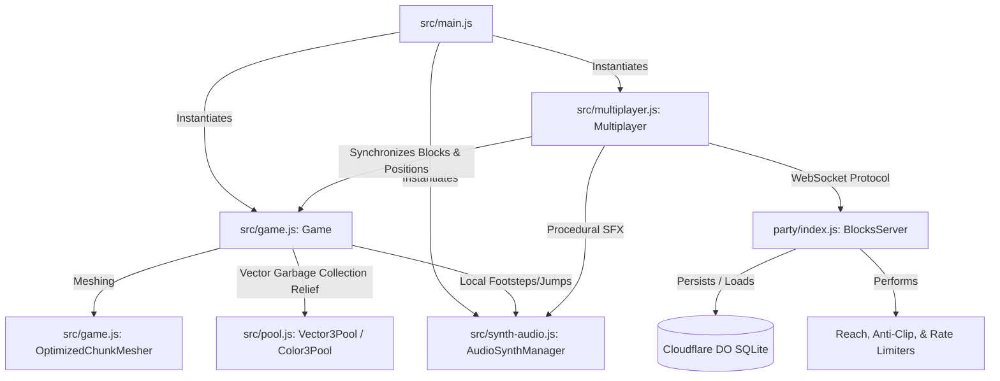

# 🌌 Blocks: High-Performance Voxel Sandbox with Real-Time Audio Synthesis & Multiplayer Sync

Welcome to **Blocks**, a web-based, low-latency multiplayer 3D voxel sandbox. Built with **HTML5**, **Babylon.js**, **Web Audio API**, **WebSockets**, and **PartyKit (Cloudflare Durable Objects)**, Blocks achieves exceptional performance on low-spec client hardware by employing state-of-the-art WebGL optimization pipelines, custom collision solvers, zero-overhead memory pools, and pre-allocated synthesizer voice routing graphs.

---

## 🚀 Key Features

*   **⚡ Real-Time Collaborative Voxel Sandbox**: Build and destroy blocks in a shared sandbox world, synced across peers at 10Hz using custom bitpacked binary WebSockets.
*   **📐 Greedy Meshing & Instancing**: An optimized chunk mesher combines matching adjacent coplanar block faces into massive quads, reducing draw calls by over 90%. Transparent flora uses instanced billboard rendering with World Matrix freezing.
*   **🎹 Procedural Audio Synthesis**: Implements a 16-channel pre-allocated Web Audio API synthesizer. Sounds (footsteps, jumps, blocks place/break) are synthesized procedurally in real-time with automatic voice stealing and 10ms click-prevention fade envelopes.
*   **🛡️ Authoritative Server-Side Validation**: Cloudflare Durable Objects enforce reach distance checks, coordinate boundaries, spawn protected safety platforms, and collision-checking to prevent block placement clipping.
*   **💾 Transactional SQLite DO Persistence**: Saves world updates in a local SQLite Durable Object, utilizing debounced in-memory write buffering to execute high-throughput transactional database commits.
*   **📊 Garbage Collection Avoidance**: Global Vector3 and Color3 object pools prevent runtime heap allocations in high-frequency loops (frames/ticking), avoiding browser micro-stutters.

---

## 🛠️ Architecture Overview

The system is decoupled into an asynchronous client-side 3D render engine and an authoritative server-side room orchestrator:



Detailed technical analysis of each module, binary packet structures, rate-limiting algorithms, and database migrations can be found in [DEVELOPER.md](file:///c:/Software/Dashboard/Blocks/DEVELOPER.md).

---

## 💻 Local Development Setup

To run the client, multiplayer server, and test suites locally, ensure you have [Node.js](https://nodejs.org/) (v18+) installed.

### 1. Install Dependencies
Clone the repository and install the package dependencies:
```bash
npm install
```

### 2. Run the Services
You must run both the frontend Vite bundler and the PartyKit backend server in parallel:

*   **Start Backend Server (PartyKit):**
    ```bash
    npm run party-dev
    ```
    *Starts the Durable Object WebSocket server on `http://localhost:1999`*

*   **Start Frontend Server (Vite):**
    ```bash
    npm run dev
    ```
    *Serves the client application on `http://localhost:5173`*

Open your browser to `http://localhost:5173` to join the sandbox world. Open multiple tabs or windows to test the real-time multiplayer synchronization!

---

## 🧪 Automated Testing

We maintain a rigorous browser integration test suite using **Playwright**. The tests run inside a headless Chromium instance to validate rendering parameters, block placements, jump curves, and collision/gravity kinematics.

To run the automated tests:
```bash
npm run test
```

> [!IMPORTANT]
> The test suite is strictly configured to execute with `--workers=1` (concurrency limit). Spawning multiple workers in parallel leads to GPU/driver stalls under emulation (lost WebGL contexts) and SQLite transaction write-locks. For detailed information, see [TESTING.md](file:///c:/Software/Dashboard/Blocks/TESTING.md).

---

## 📜 Guides and Conventions

For developers wanting to contribute or modify features:
*   **Detailed Architectural Specs**: Refer to [DEVELOPER.md](file:///c:/Software/Dashboard/Blocks/DEVELOPER.md) for in-depth system guidelines (e.g., zero-allocation coding conventions).
*   **Testing Protocols**: Refer to [TESTING.md](file:///c:/Software/Dashboard/Blocks/TESTING.md) to understand test coverage and regression prevention guidelines.
